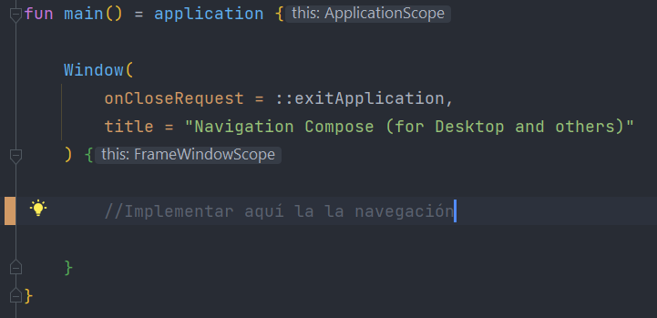
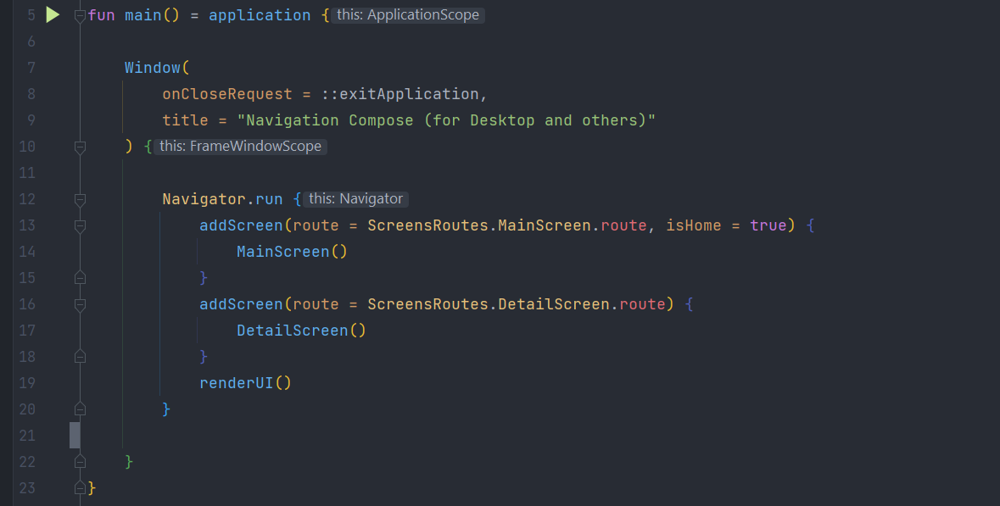
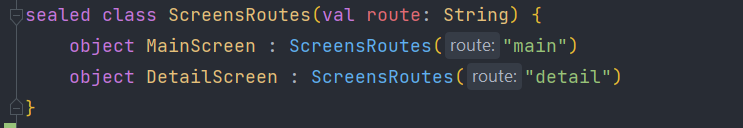

<!-- PROJECT LOGO -->
 

  
  <h1>Navigator for Jetpack Compose Desktop (and others)</h1>

  
  
  <h2>Desripción general</h2>
  

  Navigator es un objeto Kotlin que facilita la navegación entre composables en Jetpack Compose. Es un objeto sencillo (un solo archivo, menos de 40 líneas de código), claro y fácil de implementar y modificar. 
  Cuenta con tres métodos para realizar su función:
  <ul>
    <li>addScreen(): registrar un @Composable</li>
    <li>navigate(): navegar a un @Composable</li>
    <li>renderUI(): renderizar la interfaz de usuario</li>
  </ul>
  

  
  <h2>Cómo usarlo</h2>
  

    Implementar la navegación dentro del cuerpo de la aplicación, normalmente como contenido de Window:
    

     
    Si bien se puede llamar a los métodos individualmente de la forma Navigator.metodo(), resulta más práctico y descriptivo hacerlo a través de la función de alcance run():
    

  

  
  <h3>fun addScreen(route: String, isHome: Boolean = false, contentView: @Composable ()->Unit)</h3>
    

    Parámetros:
    <ul>
      <li>route (String): nombre que identifica el destino, por ejemplo: "home" o "details". Si bien puede usarse un string directamente como parámetro, 
      Google recomienda encapsular esta información en una sealed class:
      

      </li>
      <li>isHome (Boolean): indica que la pantalla es la inicial; por defecto es false.</li>
      <li>contentView (@Composable): contenido composable que representa la pantalla en cuestión.</li>
    </ul>
  

  
  <h3>fun renderUI()</h3>
  

  No recibe parámetros. Renderiza el contenido composable correspondiente. Por defecto, la pantalla marcada con "isHome=true" en addScreen().
  

  
  <h3>fun navigate(route: String)</h3>
  

  Permite navegar a un destino composable. Como ya se mencionó, conviene que el parámetro route se obtenga de una sealed class que encapsule los destinos.
  

  
  <h2>Comentarios</h2>
  <ul>
    <li>Navigator no implementa navegación hacia atrás, pero puede añadirse facilmente la funcionalidad.</li>
    <li>Los destinos composables se almacenan en un HashMap, siendo las claves de este las rutas indicadas en addScreen() y los valores los composables indicados.</li>
    <li>Navigator no contempla el paso de parámetros entre pantallas, pero puede implementarse fácilmente a través de ViewModels.</li>
  </ul>
  

